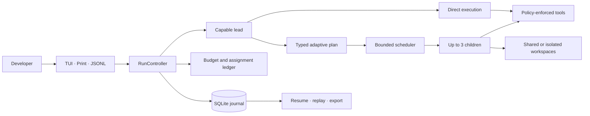

<p align="center"><strong>SKAIL</strong></p>

```text
Twin sail mark (v0.1.0, monochrome, never animated):
     /\|\
    /  | \
    /___|__\
   /____|___\
   \________/
    S K A I L
```


<p align="center">
  A Python multi-agent coding harness built on DeepAgents and LangGraph.
</p>

<p align="center">
  [](https://github.com/plum-sorathorn/Skail/actions/workflows/ci.yml)
  [](https://www.python.org/downloads/)
  [](LICENSE)
  [](https://github.com/langchain-ai/deepagents)
  [](https://github.com/langchain-ai/langgraph)
  [](https://github.com/langchain-ai/langchain)
  [](https://github.com/Textualize/textual)
  [](https://github.com/pydantic/pydantic)
  [](https://www.sqlite.org/)
</p>

# Skail

Skail is an agentic AI and multi-agent coding harness built on
[DeepAgents](https://github.com/langchain-ai/deepagents). It uses
**[LangGraph](https://github.com/langchain-ai/langgraph)** for durable,
stateful orchestration—including direct execution, dependency-aware task graphs, checkpointing,
human-in-the-loop interrupts, and resumable sessions—and
**[LangChain](https://github.com/langchain-ai/langchain)** abstractions for LLM
provider integration, model invocation, structured output, and tool calling.

Its systems stack combines **[Pydantic](https://github.com/pydantic/pydantic)** contracts,
**[SQLite](https://www.sqlite.org/)** persistence, asynchronous Python
concurrency, Git worktree isolation, budget-aware model routing, provider usage accounting,
context engineering, and a **[Textual](https://github.com/Textualize/textual)** terminal UI. Skail coordinates specialized subagents while
enforcing task dependencies, bounded retries, verification evidence, permissions, and hard cost
limits in deterministic runtime code.

Skail runs locally without a proxy server or daemon and exposes an interactive TUI, a conventional
CLI, and versioned JSONL event streaming for automation. The Python distribution is
`skail-harness`; the console command is `skail`.

## Why Skail?

Building a coding agent is straightforward. Making it dependable across planning, parallel work,
cost control, recovery, and verification is the harder part. Skail provides those runtime
guarantees out of the box:

- **Adaptive execution** — simple requests stay direct; complex work can use discovery checkpoints
  or a typed, dependency-aware plan.
- **Task-bound model routing** — each lead run and child attempt receives a durable provider/model
  assignment based on capability, role, evidence, health, and budget.
- **Hard budget control** — reservations happen before provider calls, usage is settled once, and
  uncertain accounting blocks unsafe replay.
- **Safe parallel work** — up to three children can run concurrently; writers use reproducible Git
  worktrees when available and serialized integration when changes return.
- **Human checkpoints** — project trust, tool approvals, questions, steering, and cancellation are
  enforced by runtime policy rather than prompt compliance.
- **Durable sessions** — SQLite-backed plans, assignments, events, approvals, usage, checkpoints,
  compaction, recovery, and exports survive interruption.
- **Context engineering** — bounded task packets, skills, memory, artifact references, output
  offloading, and compaction keep model context focused.
- **Terminal-native interfaces** — work interactively in the TUI, capture only the final answer, or
  consume a stable JSONL event stream from scripts.

The control plane runs locally with SQLite state and direct provider adapters; no service
infrastructure is required.

## Release status

The v0.1.0 source candidate has passed candidate-bound Windows verification through Phase 22,
including the offline, packaging, smoke, benchmark, and paired-evaluation checks, plus Windows
verification of the journal connection-pool fix (`6809874`) and the eval-journal-close fix
(`421e8e4`): 1377.8 appends/sec on `421e8e4` (Windows, Python 3.14.6) against the unchanged 100
appends/sec gate, with synchronous=FULL and per-op commit/rollback preserved. Exact-final-
commit Windows/Linux verification remains pending; the Phase 22 evidence cannot certify this
documentation commit. Windows is green on `421e8e4`; Linux CI raw evidence is still required
and Linux green is not claimed. Live-provider quality and economic qualification remain a
separate Q1 track.

## Getting started

### Quickstart from source

```powershell
git clone https://github.com/plum-sorathorn/Skail -b skail
cd Skail
python -m pip install -e ".[dev]"

# Verify the installation without credentials
skail smoke --fake-provider

# Run a deterministic local request
skail --print --fake-provider --model fake:fast-model "Summarize this workspace"
```

For normal interactive use, configure a supported provider, verify it without making a network
request, then launch Skail:

```powershell
skail auth check
skail models list
skail
```

Useful bounded invocations:

```powershell
# Cap spend and parallelism while preferring isolated writers
skail --budget 2.50 --mode economy --max-agents 2 --workspace worktree `
  "Implement and verify this change"

# Emit versioned events for automation
skail --jsonl --budget 1.00 "Inspect the repository and report findings"

# Resume durable work
skail sessions list
skail --resume <session-id>
```

See the [CLI contract](docs/skail/CLI.md) for every flag, subcommand, output mode, and exit code.

### Interactive TUI

Launch `skail` in a TTY to mount the cockpit immediately; provider and model
setup runs in a background worker after the shell is visible. First run walks
a mount-first 5-step onboarding ladder:

1. Welcome (Twin sail mark + overview)
2. Provider (LLM Gateway / OpenAI / Anthropic / Fake)
3. Trust (trust this exact folder, or restricted mode)
4. Theme (Dark / Light / System / Pistachio Night / Pistachio Paper / Mint Porcelain with live preview)
5. Ready (receipt with the exact `skail -r <session-id>` resume command)

```powershell
# No credentials needed for local evaluation
skail --fake-provider

# Normal interactive start after provider setup
skail auth check
skail models list
skail
```

Keybindings: `Shift+Tab` cycles the Agents, Plan, Route, and Budget panels while
keeping the composer focused, `Alt+P` opens the model picker (future attempts
only), and `/mode` changes routing mode. The transcript and side panels are
display-only; the removed Ctrl+A/B/P/R bindings cannot steal focus. `Esc` goes
back one step and never approves (pending approvals stay pending), `Ctrl+O`
opens the transcript overlay, `Ctrl+T` opens Mission Control (child agents),
`Ctrl+Shift+T` focuses chat/composer, and `?` opens the shortcuts pane
(type-to-filter). While a run is active, `Ctrl+Enter` queues a follow-up; take
back the newest queued prompt from the queue view. `skail -r <session-id>`
resumes any durable session.
Headless use is unchanged: `skail -p "<prompt>"` prints the final answer,
`skail --jsonl` streams versioned events, `-c` continues, `-r` resumes, and
`--no-session` runs without persistence.

## Architecture



| Execution path | Best for | Coordination | Workspace behavior |
| --- | --- | --- | --- |
| Direct | Small edits, inspection, and focused commands | The lead works in its normal tool loop | Shared workspace with policy-enforced writes |
| Discovery | Work whose shape depends on repository evidence | Read-only frontier, checkpoint, then evidence-backed revision | Read-only discovery before later admitted work |
| Planned | Multi-step or parallel work with known dependencies | Durable nodes release when verified prerequisites complete | Isolated worktrees when safe; serialized fallback and integration |

> **Skail is a local application boundary.** It runs with the invoking user's operating-system
> permissions. Workspace confinement, trust, approvals, redaction, and budgets govern actions that
> pass through Skail; trusted programs and privileged host processes remain the user's
> responsibility.

## Documentation

| Section | What you'll find |
| --- | --- |
| [Product specification](docs/skail/SPEC.md) | Product behavior, users, commands, configuration, and acceptance criteria |
| [Architecture](docs/skail/ARCHITECTURE.md) | Runtime topology, graph composition, persistence, routing, budgets, and safety boundaries |
| [Feature contracts](docs/skail/FEATURES.md) | Exact behavior for agents, tools, sessions, approvals, context, and terminal interfaces |
| [CLI reference](docs/skail/CLI.md) | Invocation syntax, subcommands, JSONL framing, and process exit codes |
| [Threat model](docs/skail/THREAT_MODEL.md) | Trust boundaries, mitigations, and residual host-level risks |
| [Evaluation](docs/skail/EVALUATION.md) | Independent fixtures, raw evidence, routing gates, and qualification rules |
| [Performance](docs/skail/PERFORMANCE.md) | Reproducible runtime, rendering, persistence, and context measurements |
| [Feature roadmap](docs/skail/FEATURE_PARITY_ROADMAP.md) | Core acceptance matrix and separately scoped follow-on integrations |
| [Final integrated review](docs/skail/PHASE_21_REVIEW.md) | Cross-phase findings, representative traces, and release evidence boundaries |
| [Changelog](CHANGELOG.md) | Notable v0.1.0 fixes, performance evidence, and release status |
| [Dependencies](docs/skail/DEPENDENCIES.md) | Pinned runtime dependencies, provider extras, and transitive tooling |

## Benchmarks

Skail includes reproducible local benchmarks ([bench_runner](benchmarks/bench_runner.py)) and an independently scored offline evaluation suite.
Run them against the same source and environment you want to measure:

```powershell
python benchmarks\bench_runner.py --json --repetitions 5
python scripts\eval_routing.py --paired-runtime --output $env:TEMP\skail-eval.json
python scripts\release_check.py
```

The suite measures orchestration, persistence, context, rendering, workspace, and paired execution
behavior from raw records. Deterministic fake-provider evidence verifies the engineering contract;
it is not a live-provider quality or savings claim.

## Contributing

Issues, pull requests, tests, and documentation improvements are welcome. Read
[AGENTS.md](AGENTS.md) for the repository conventions and keep changes focused, typed, offline by
default, and backed by the appropriate tests.

```powershell
rtk pytest -q
python -m ruff check src tests scripts evals benchmarks
python -m mypy src\skail
python scripts\smoke.py --fake-provider
python scripts\package_check.py
```

Report bugs or propose changes through [GitHub Issues](https://github.com/plum-sorathorn/Skail/issues).
For the project's security boundaries, start with the [threat model](docs/skail/THREAT_MODEL.md).

## Project links

- [GitHub repository](https://github.com/plum-sorathorn/Skail)
- [Issue tracker](https://github.com/plum-sorathorn/Skail/issues)
- [Documentation index](docs/skail/README.md)
- [Implementation and release guide](tasks/skail-adaptive-orchestration-and-release-plan.md)

## License

Skail is released under the [MIT License](LICENSE).
