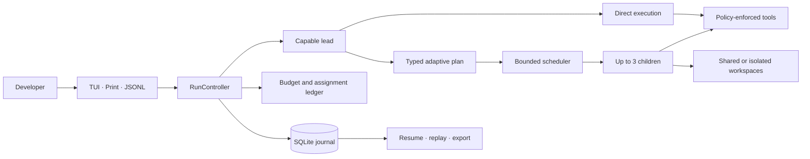

<p align="center">
  
</p>

<h1 align="center">Skail</h1>

<p align="center">
  <strong>A budget-aware, local-first multi-agent coding harness built on DeepAgents and LangGraph.</strong>
</p>

[Python 3.12+](https://www.python.org/downloads/) · [MIT License](LICENSE) · [Evaluation](docs/skail/EVALUATION.md)

[DeepAgents](https://github.com/langchain-ai/deepagents) · [LangGraph](https://github.com/langchain-ai/langgraph) · [Textual](https://github.com/Textualize/textual) · [Pydantic](https://github.com/pydantic/pydantic) · [SQLite](https://www.sqlite.org/)

Skail is an agentic AI and multi-agent coding harness built on [DeepAgents](https://github.com/langchain-ai/deepagents) and [LangGraph](https://github.com/langchain-ai/langgraph). It provides deterministic runtime controls for application-level budgets, workspace writes, task-bound model routing, and durable SQLite persistence, so developers can delegate complex, parallel coding workflows with bounded, reviewable changes.

Skail runs locally on your machine without a proxy server or background daemon. It exposes an interactive terminal UI (cockpit), a scriptable CLI, and versioned JSONL event streaming for automated pipelines.

> **Status: Alpha v0.1.0.** The [evaluation](docs/skail/EVALUATION.md) and [performance](docs/skail/PERFORMANCE.md) documents record offline engineering checks and performance measurements. They do not establish live-provider quality or savings. Skail's budget gates use in-house token-cost estimates; they do not guarantee billed spend.

---

## Why Skail?

Building an ad-hoc coding agent is straightforward. Making it dependable across planning, parallel work, cost containment, crash recovery, and verification is where harnesses typically break down. Skail enforces these guarantees in deterministic runtime code:

- **Application Budget Gates**: Skail prices measured input, output, and cached-input tokens using rates frozen for each model assignment. The TUI shows cumulative session cost including lead and child agents; missing usage remains conservative or unresolved, and unsafe replay is blocked.
- **Safe Parallel Subagents**: Up to three child agents can run concurrently. Writers use isolated Git worktrees when enabled and safe; otherwise, a write lease serializes shared-workspace changes.
- **Adaptive Task Execution**: Direct execution for simple fixes, checkpointed discovery for open exploration, or typed dependency graphs for multi-step implementations.
- **Task-Bound Model Routing**: Each lead run and child attempt receives a durable model assignment matched to capability requirements, role floors, and budget mode.
- **Human Checkpoints and Approvals**: Tool approvals, project trust levels, interactive clarification questions, and execution steering are enforced by code policy rather than prompt hope.
- **Durable SQLite Sessions**: Run, plan, assignment, event, approval, and usage records support recovery and export. Resuming restores the owning run's checkpoint; new instructions start fresh run context.
- **Terminal Cockpit and Scriptable CLI**: Work interactively in the full Textual TUI cockpit, or run headlessly in scripts, CI pipelines, and cron jobs via `-p` and `--jsonl`.
- **Local Control Plane**: Skail runs its control plane on your machine and calls configured model providers directly. It requires no Skail-hosted proxy or background daemon.

---

## Getting Started

### 1. Installation

Skail requires Python 3.12 or newer and Git.

```powershell
# Clone the repository
git clone https://github.com/plum-sorathorn/Skail -b skail
cd Skail

# Install in editable mode with development tools
python -m pip install -e ".[dev]"

# Verify the installation offline
python scripts\smoke.py
```

### 2. Configure Credentials

Set your provider API key in your environment. Skail supports Anthropic, OpenAI, LLM Gateway, and OpenAI-compatible endpoints:

```powershell
# Anthropic
$env:ANTHROPIC_API_KEY = "replace-with-your-key"

# Or OpenAI
$env:OPENAI_API_KEY = "replace-with-your-key"

# Or LLM Gateway
$env:LLMGATEWAY_API_KEY = "replace-with-your-key"

# Verify credentials without making external API calls
skail auth check
```

Credentials can also be stored securely in your OS keyring during first-time interactive setup.

### 3. Launch Skail

Launch the interactive cockpit or run targeted commands directly from the shell:

```powershell
# Launch the interactive Textual TUI cockpit
skail

# One-shot execution: inspect code and print the final answer
skail -p "Inspect the CLI parser and report all supported flags"

# Apply Skail's estimated run budget and request worktree isolation when available
skail --budget 2.50 --mode economy --workspace worktree `
  "Implement and verify session resume error handling"

# Stream versioned JSONL events for scripts or automation
skail --jsonl --budget 1.00 "Run smoke verification"
```

---

## Supported Providers and Model Routing

Skail decouples runtime task roles from specific models, enabling budget-aware routing across different providers:

| Provider | Environment Variable | Extra Dependency | Notes |
| --- | --- | --- | --- |
| **Anthropic** | `ANTHROPIC_API_KEY` | `skail-harness[anthropic]` | Select model IDs enabled for your account. |
| **OpenAI** | `OPENAI_API_KEY` | `skail-harness[openai]` | Select model IDs enabled for your account. |
| **LLM Gateway** | `LLMGATEWAY_API_KEY` | Core adapter | Uses the gateway's validated model catalog. |
| **OpenAI-Compatible** | Configured per provider | `skail-harness[openai-compatible]` | Set `base_url`, model IDs, and the configured key environment variable. |

Model availability changes over time. Use `skail models list` to inspect configured models and the local catalog snapshot. Install provider extras as needed; for example, use `python -m pip install -e ".[anthropic]"` to add Anthropic support to a core installation.

### Routing Modes

Pass `--mode <mode>` or use the `/mode` command inside the cockpit:

| Mode | Behavior | Best Used For |
| --- | --- | --- |
| **auto** *(default)* | Selects models dynamically based on task requirements, role floors, and budget limits | Everyday balanced engineering work |
| **economy** | Prefers cost-effective models while respecting minimum role floors | High-volume tasks, documentation, and simple refactoring |
| **quality** | Prefers higher-capability models for planning, lead orchestration, and code generation | Complex multi-file architectural refactoring and debugging |
| **manual** | Enforces user-selected models without automatic tier adjustments | Explicit benchmarking and targeted testing |

---

## Interactive Cockpit (TUI)

Launching `skail` opens the full Textual terminal cockpit. The cockpit runs an onboarding check on first launch (provider selection, project trust verification, and theme preference) and connects directly to the local SQLite session store.

### Key Controls

| Shortcut / Command | Action |
| --- | --- |
| `Shift+Tab` | Cycle through the Agents, Plan, Route, and Budget panels while keeping the composer focused |
| `Alt+P` | Open the model picker overlay (affects subsequent attempts) |
| `/mode` | Switch the active routing mode (`auto`, `economy`, `quality`, `manual`) |
| `Ctrl+T` | Open Mission Control overlay to inspect active child agent tasks |
| `Ctrl+Shift+T` | Refocus the chat composer input |
| `Ctrl+O` | Open full transcript viewer overlay |
| `Ctrl+Enter` | Queue a follow-up prompt while a task run is actively executing |
| `?` | Open keyboard shortcuts and help overlay |
| `Esc` | Navigate back one level without approving pending actions |

### Resuming Durable Sessions

Run records and usage are stored in the local journal; runnable state is stored in the checkpoint database. Resuming an interrupted session restores its active run. A new instruction starts a fresh run context:

```powershell
# List existing sessions
skail sessions list

# Resume a specific session
skail -r <session-id>

# Resume the most recent session
skail -c
```

---

## Architecture



### Execution Topology

| Execution Path | Best For | Coordination | Workspace Isolation |
| --- | --- | --- | --- |
| **Direct** | Small edits, quick inspection, and focused commands | Lead agent runs a direct tool loop | Shared workspace with policy-enforced writes |
| **Discovery** | Tasks requiring repository reconnaissance before planning | Read-only discovery frontier with checkpoints | Read-only workspace before work is admitted |
| **Planned** | Multi-file or parallel changes with defined dependencies | Durable plan nodes release when prerequisites finish | Worktrees when enabled and safe; otherwise serialized shared-workspace writes |

> **Security & Boundary Notice**: Skail is a local application boundary running with your user permissions. Confinement, approvals, redaction, and application-level budget gates govern actions that pass through the harness. The local ledger estimates token-priced usage; extra fees and incomplete usage can make actual charges differ. Host operating system security remains the user's responsibility.

---

## Benchmarks and Evaluation

Skail includes reproducible local benchmarks and an independently scored offline evaluation suite:

```powershell
# Run performance and latency benchmark suite
python benchmarks\bench_runner.py --json --repetitions 5

# Run the paired offline evaluation
python scripts\eval_routing.py --paired-runtime --output $env:TEMP\skail-eval.json

# Run release boundary validation
python scripts\release_check.py
```

The offline evaluation suite checks routing and orchestration against deterministic scripted fixtures. The benchmark suite measures persistence, context assembly, and TUI rendering separately. Neither establishes real-provider quality or billed spend and savings.

---

## Documentation

Comprehensive architecture, specifications, and contracts are located in the `docs/` directory:

| Document | Description |
| --- | --- |
| [Product Specification](docs/skail/SPEC.md) | System requirements, user personas, CLI interface, and acceptance criteria |
| [Architecture Reference](docs/skail/ARCHITECTURE.md) | Runtime topology, graph composition, state machine, and persistence |
| [Feature Contracts](docs/skail/FEATURES.md) | Exact contracts for agents, tools, sessions, approvals, and context engine |
| [CLI Specification](docs/skail/CLI.md) | Complete CLI argument parser, flags, exit codes, and JSONL schema |
| [Threat Model](docs/skail/THREAT_MODEL.md) | Security boundaries, trust levels, and host isolation mitigations |
| [Evaluation Guide](docs/skail/EVALUATION.md) | Offline fixture evaluation, routing gates, and qualification scoring |
| [Performance Hardening](docs/skail/PERFORMANCE.md) | Benchmarking methodology, memory limits, and context compaction rules |
| [Dependency Audit](docs/skail/DEPENDENCIES.md) | Pinned runtime dependencies, provider extras, and license audit |
| [Changelog](CHANGELOG.md) | Version history, release milestones, and fixed defects |

---

## Contributing

Contributions, issues, and feature proposals are welcome. Please read [AGENTS.md](AGENTS.md) for coding standards, typing requirements, and architecture constraints.

To run the local verification suite:

```powershell
# Run test suite
python -m pytest -q

# Run code style, typing, and smoke checks
python -m ruff check src tests scripts evals benchmarks
python -m mypy src\skail
python scripts\smoke.py
python scripts\package_check.py
```

Report issues and submit pull requests on [GitHub Issues](https://github.com/plum-sorathorn/Skail/issues).

---

## Maintenance and Uninstall

To cleanly remove Skail from your system, including its OS keyring credentials, configuration files in `~/.skail`, and the installed package:

```powershell
# Remove credentials, state root, and installed package
.\scripts\uninstall_skail.ps1 -Yes

# Optionally clean legacy workspace roots
.\scripts\uninstall_skail.ps1 -Yes -LegacyWorkspaceRoots C:\path\to\workspace
```

The uninstall script is destructive and strictly scoped to Skail-managed paths.

---

## License

Skail is open-source software licensed under the [MIT License](LICENSE).
