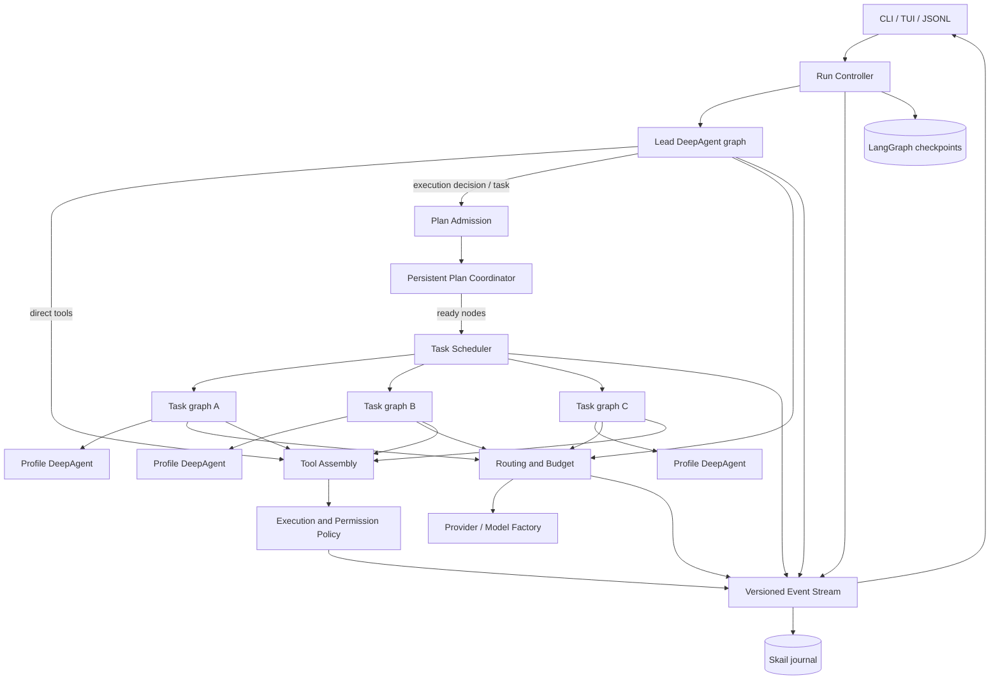
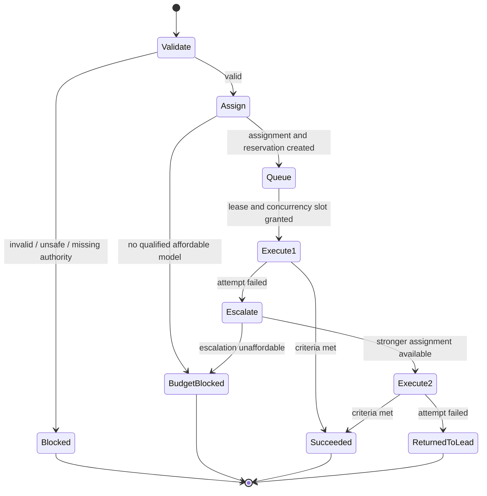

# Skail Architecture

> Status note: this is the normative architecture contract. It does not replace implementation
> tests, raw evidence, or exact-candidate release verification. See

Status: Approved
Date: 2026-09-02
Depends on: [SPEC.md](./SPEC.md)

## 1. Architectural intent

Skail Harness is a native terminal coding harness. DeepAgents supplies the agent runtime, LangGraph supplies durable graph execution and checkpointing, and Skail owns the product policies around task creation, model assignment, budgets, scheduling, safety, events, and presentation.

The framework is a dependency, not the product boundary. Skail code must interact with DeepAgents through small adapters so that preview features and framework API changes do not leak into the rest of the system.

## 2. Runtime topology



Only the lead may create first-level delegated tasks by default. A maximum of three children execute
at once. Plan admission, coordination, and scheduling are Skail components, even though the `task`
tool and child execution use DeepAgents. The fixed coordinator interprets typed data; it never
executes model-authored code.

## 3. What DeepAgents owns

Skail should use, rather than reproduce:

- `create_deep_agent()` to compose the lead and profile agents;
- the standard filesystem, execution, todo, skills, and memory middleware/tools where their behavior meets the contract;
- the standard `task` tool surface presented to the lead;
- compiled subagents through `CompiledSubAgent` for Skail-owned task lifecycle graphs;
- LangGraph state, streaming, interrupts, and checkpoints;
- the synchronous subagent implementation for the stable foreground path;
- the preview async-subagent implementation only through an optional adapter.

DeepAgents subagents are not merely static nodes in the lead graph. The lead calls a `task` tool; the subagent middleware invokes a separately compiled runnable. Skail makes that runnable a small task lifecycle graph whose execution node is itself a DeepAgent. This gives Skail an enforceable assignment and retry boundary while retaining the framework's context isolation and nested streaming.

Framework assumptions must be covered by contract tests because they are not Skail-controlled APIs. The source baseline used for this design is listed in [README.md](./README.md).

## 4. What Skail owns

Skail owns these semantics and may not delegate them to prompts:

- parsing explicit user constraints;
- deciding the task contract handed to a subagent;
- task IDs, parentage, attempts, and terminal states;
- model catalog evidence and automatic-routing eligibility;
- model selection and task-attempt stickiness;
- cost estimation, reservation, and hard budget launch gates;
- concurrency, dependencies, delegation depth, and write leases;
- project trust, command policy, and permissions not covered by built-in tools;
- run-wide model-call budgets, deterministic failure signals, and the one-escalation policy;
- provider health, fallback recording, and usage normalization;
- stable user-facing events, errors, CLI behavior, and persistence;
- compatibility adapters around DeepAgents preview or changing APIs.
- execution-decision admission, plan identity/revision, ready-queue dispatch, and integration state;
- schema ownership and migration for plans, routes, workspaces, change sets, and verification.

## 5. Graph composition

### 5.1 Lead graph

`LeadBuilder` constructs one `create_deep_agent()` graph per user-instruction run. Its stable components are:

- a routed chat model supplied by `TaskBoundModelMiddleware`;
- a system prompt assembled from Skail rules, user instructions, trusted project instructions, and the selected lead profile;
- default tools assembled by `ToolRegistry`;
- DeepAgents filesystem, execution, todo, skills, memory, and subagent middleware;
- a standard `task` tool whose built-in profiles are supplied as compiled Skail task graphs;
- a LangGraph checkpoint thread keyed by session and run IDs;
- event and usage middleware.

The first necessary lead response ends with a final answer or records a typed execution decision,
unless the user explicitly requires a mode such as planned execution. In that case, the runtime
requires a matching decision before the run can complete, including after a question interrupt and
resume. Runtime middleware admits that decision before operational tool calls from the same response.
A scoped question interrupt is allowed before the decision when required. When the instruction
explicitly requires a user choice, the runtime blocks decisions and operational tools until an
`ask_user` interrupt receives an accepted answer; a final prose question cannot complete the run.
Direct mode retains the
normal tool loop; discovery records a bounded frontier and checkpoint; planned mode records a finite
dependency graph. The standard `task` call admits one node through the same service.

The lead assignment is created at the beginning of each user-instruction run and remains fixed until the lead reaches a terminal response, is cancelled, or starts an explicitly recorded fallback attempt. It is not permanently fixed for the entire conversation. Plan waits, revisions, and integration do not replace a healthy assignment.

### 5.2 Persistent plan coordinator

The coordinator persists plan schema/policy version, plan and node IDs, revision, dependencies,
acceptance criteria, effects, resource scopes, and decision checkpoints before dispatch. It allocates
opaque persistent IDs from model-supplied local names and rejects cycles, missing references,
duplicate objectives, invalid scopes, and unauthorized effects atomically.

A durable ready queue releases nodes after successful prerequisites without waking the lead for
ordinary worker success. Discovery checkpoints, contradictory evidence, changed scope, unresolved
failure, integration conflict, material steering, and final synthesis wake the lead. Revisions name
the expected prior revision and may add, replace, or cancel unfinished nodes; completed identities
and the two-attempt fingerprint remain stable.

When a checkpoint reaches `ready`, the coordinator durably records its launch, marks it running,
and wakes the same lead attempt with the current plan plus only the evidence references produced by
the checkpoint's successful prerequisites. The next `execution_decision` carries the complete next
plan and a typed `PlanRevision`. Skail rejects invented evidence, applies the journal revision
compare-and-set, and settles the checkpoint successfully only after that revision commits. A lead
response without an admissible revision blocks the checkpoint rather than completing the run.

### 5.3 Compiled task graph

Each built-in subagent profile supplied to DeepAgents is a `CompiledSubAgent`. It implements this lifecycle:



Conceptual nodes:

1. `validate_task`: normalize the request, validate depth/profile/tools/scope, and create a task fingerprint.
2. `assign_attempt`: derive requirements, select a concrete model, and reserve budget.
3. `acquire_execution`: wait for dependencies, the global child semaphore, and any write lease.
4. `run_profile_agent`: invoke the selected DeepAgent with the assignment frozen in state.
5. `evaluate_attempt`: combine structured agent output, verification evidence, deterministic failure signals, and runtime outcome.
6. `escalate_once`: build a bounded failure handoff, exclude the failed model, and request a stronger assignment.
7. `return_result`: emit a stable `TaskResult` to the lead.

The graph, rather than the child prompt, enforces the attempt limit.

### 5.4 Model binding

DeepAgents and LangChain allow middleware to override a request model. Skail uses that mechanism only to install the model already chosen for the current task attempt.

`TaskBoundModelMiddleware.wrap_model_call()` performs this logic:

```text
assignment = state.current_assignment
if assignment is missing:
    raise invariant_error("route.assignment_missing")
model = model_factory.get(assignment.provider, assignment.model)
return handler(request.override(model=model))
```

It does not call the router. Selection occurs in `assign_attempt` or the lead-run setup. The middleware validates that every subsequent model request in the attempt has the same assignment ID. A mismatch is an invariant failure and is recorded before the run stops safely.

### 5.5 Synchronous stable path

The first stable release uses synchronous DeepAgents subagents:

- one lead turn may issue multiple independent `task` calls;
- DeepAgents may execute those calls concurrently;
- Skail's scheduler/semaphore still enforces the configured maximum;
- the lead waits for the batch, while nested events stream to the UI;
- foreground cancellation cancels the active lead run and all its unfinished child calls.

This path is release-critical because synchronous subagents are the mature framework feature.

### 5.6 Optional asynchronous path

Background agents use a `TaskExecutor` adapter. No caller outside the adapter may import the framework's Agent Protocol types.

```python
class TaskExecutor(Protocol):
    async def start(self, request: TaskRequest) -> TaskHandle: ...
    async def status(self, task_id: TaskId) -> TaskSnapshot: ...
    async def update(self, task_id: TaskId, message: str) -> None: ...
    async def cancel(self, task_id: TaskId) -> None: ...
    async def result(self, task_id: TaskId) -> TaskResult: ...
```

Implementations:

- `ForegroundTaskExecutor`: stable, in-process compiled subagent invocation;
- `BackgroundTaskExecutor`: experimental adapter over DeepAgents async subagents;
- `FakeTaskExecutor`: deterministic tests.

If async framework support changes, only `BackgroundTaskExecutor` and its contract tests change.

### 5.7 Context assembly

Before each lead or compiled-child model attempt, Skail assembles a versioned context packet. The
packet contains the minimum stable task state plus labelled references selected under user, trust,
permission, task-scope, and budget boundaries. It records approximate token pressure, component
sources/revisions, and whether content was selected, compressed, truncated, or omitted.

The packet keeps the model-facing working set distinct from journal and checkpoint state. Journal and
checkpoint records retain authoritative history; artifacts and event IDs make detail available just
in time without reinjecting it. Task packets never inherit the lead transcript by default. Failure
handoffs and child results are structured, bounded evidence objects.

Context pressure triggers deterministic compaction that preserves current intent, explicit user
constraints, task/attempt state, assignments/budgets, approvals/questions, changed paths and
verification, unresolved errors, and references to original records. Runtime policy—not prompt
instructions—enforces trust, permissions, and context scope.

## 6. Domain contracts

The names below are normative; field details may change through an ADR before implementation.

### 6.1 Identifiers

Use standard opaque UUID4 strings for `session_id`, `run_id`, `task_id`, `attempt_id`, `assignment_id`, and `event_id`. IDs are serialized as strings and never encode mutable state. Ordering comes from explicit timestamps and run-local sequence numbers, so Python 3.12 needs no extra ID dependency.

### 6.2 Task request and specification

```python
class TaskRequest(BaseModel):
    description: str
    profile: str = "general-purpose"
    success_criteria: tuple[str, ...] = ()
    depends_on: tuple[TaskId, ...] = ()
    write_scope: tuple[str, ...] = ()
    model_policy: ModelConstraint | None = None
    budget_usd: Decimal | None = None
    background: bool = False


class TaskSpec(BaseModel):
    task_id: TaskId
    run_id: RunId
    parent_task_id: TaskId | None
    depth: int
    fingerprint: str
    request: TaskRequest
    requirements: CapabilityRequirements
    permission_set: PermissionSet
```

The lead supplies `TaskRequest`. Skail creates `TaskSpec`; model-generated IDs, budgets, or permission claims are ignored.

### 6.3 Assignment

```python
class TaskAssignment(BaseModel):
    assignment_id: AssignmentId
    task_id: TaskId
    attempt_number: Literal[1, 2]
    provider: str
    model: str
    routing_mode: RoutingMode
    capability_floor: float | None
    estimated_attempt_cost_usd: Decimal
    reservation_id: str
    explanation: tuple[str, ...]
    catalog_revision: str
```

An assignment is immutable. Escalation creates another assignment.

### 6.4 Attempt and result

```python
class TaskAttempt(BaseModel):
    attempt_id: AttemptId
    assignment: TaskAssignment
    started_at: datetime
    ended_at: datetime | None
    status: AttemptStatus
    failure: FailureReport | None
    actual_usage: NormalizedUsage | None


class TaskResult(BaseModel):
    task_id: TaskId
    status: Literal[
        "succeeded", "failed", "blocked", "cancelled",
        "budget_blocked", "returned_to_lead"
    ]
    summary: str
    artifacts: tuple[ArtifactRef, ...]
    verification: tuple[VerificationResult, ...]
    attempts: tuple[AttemptSummary, ...]
    changed_paths: tuple[str, ...]
    follow_up: str | None
```

The result returned through `task` must be concise enough for the lead context. Full events and transcripts remain queryable by ID.

### 6.5 Task state machine

Allowed task states:

```text
proposed -> queued -> running -> succeeded
                            -> failed -> queued (attempt two only)
                            -> returned_to_lead
                            -> blocked
                            -> budget_blocked
                            -> cancelled
```

State transitions are compare-and-set operations in the task registry. Duplicate terminal transitions are ignored and recorded as diagnostic events. Resume must never turn a terminal task back into a runnable task.

## 7. Routing architecture

### 7.1 Components

- `RequirementBuilder`: converts task profile, risk, context, modality, tools, and explicit constraints into hard/soft requirements.
- `ModelCatalog`: immutable snapshot of normalized model profiles for one route decision.
- `RoutingPolicy`: pure, deterministic selection over requirements, candidates, budget, and health snapshot.
- `ModelFactory`: creates/caches provider-native LangChain chat model instances from an assignment.
- `ProviderHealth`: records bounded transient failures without rewriting capability evidence.
- `RouteExplainer`: emits included/excluded candidates and binding constraints.

The policy is synchronous and has no network or file I/O. Catalog refresh and health writes happen outside the selection path.

### 7.2 Model profile

```python
class ModelProfile(BaseModel):
    provider: str
    model: str
    aliases: tuple[str, ...] = ()
    input_usd_per_million: Decimal | None
    output_usd_per_million: Decimal | None
    cached_input_usd_per_million: Decimal | None = None
    context_tokens: int | None
    max_output_tokens: int | None
    supports_tools: bool | None
    supports_structured_output: bool | None
    supports_reasoning: bool | None
    input_modalities: frozenset[str]
    capability: CapabilityVector | None
    evidence: EvidenceRecord | None
    catalog_updated_at: datetime
    auto_eligible: bool
```

`auto_eligible` requires all hard capabilities needed by the task, usable price data when a hard budget applies, and trusted capability evidence. A model can remain available for manual selection when `auto_eligible` is false.

### 7.3 Selection procedure

For each assignment:

1. Snapshot the effective config, catalog revision, budget, and provider health.
2. Apply explicit model/provider allow and deny rules.
3. Remove unhealthy, disabled, previously failed, incompatible, or unmeasured candidates.
4. Enforce context, modality, tool, structured-output, and role-hard-min requirements.
5. Compute capability fit and remove candidates below the effective floor.
6. Estimate the attempt cost using current input size, expected role call count, and output allowance.
7. Remove candidates that cannot be reserved under task/run budgets.
8. Rank according to routing mode.
9. Reserve budget atomically.
10. Persist and emit the decision before constructing the model.

If no candidate remains, return a structured `RouteFailure` with excluded counts and actionable reasons. Never silently select an incompatible model.

### 7.4 Ranking

For `auto`, candidates are ordered by:

1. estimated attempt cost ascending;
2. capability fit descending;
3. observed tool reliability descending;
4. latency estimate ascending;
5. stable provider/model key ascending.

For `economy`, use the adjusted floor and the same ordering. For `quality`, order capability fit descending, tool reliability descending, then estimated cost ascending. For `manual`, validate and use the exact model.

Stable final ordering makes replay tests deterministic.

### 7.5 Provider fallback versus escalation

These are different state transitions:

- A transport fallback handles failure before useful agent execution, such as a rate limit or provider outage. It may select the same model on a configured equivalent endpoint and does not consume the task escalation.
- A task escalation follows an unsuccessful agent attempt, excludes the concrete failed model, raises the floor, and consumes the single retry.

Every fallback creates a new assignment ID and event. There is no invisible provider substitution.

## 8. Budget architecture

### 8.1 Ledger terms

- `actual`: historical provider-authoritative usage already incurred;
- `estimated_actual`: incurred usage calculated locally from measured tokens and frozen prices,
  or conservatively estimated when complete tokens are unavailable;
- `reserved`: allowance for approved but unfinished calls/tasks;
- `available`: hard limit minus actual, estimated actual, and reserved;
- `lead_continuation_allowance`: reserved capacity for the lead to process child results.

Use `Decimal` for money. Persist USD amounts as decimal strings, not floats.

### 8.2 Reservation transaction

```text
BEGIN IMMEDIATE
read current actual + reserved
if requested + required lead allowance > available:
    rollback -> budget_blocked
insert reservation
commit
```

When a call completes, price its measured tokens at the assigned model's frozen rates and convert
the relevant reservation to usage in one transaction. Release unused reservation. If the local
cost exceeds the reservation, record the bounded overshoot and make future gates use the new
balance. Child task usage shares the parent run's ledger.

### 8.3 Parallel batches

Before a task batch is dispatched, reserve every proposed child plus one lead allowance atomically. If the entire batch does not fit, the scheduler asks the routing policy for a smaller affordable subset ordered by dependency and expected value. The lead receives structured deferrals; it is not told that unfunded tasks ran.

## 9. Scheduler and concurrency

### 9.1 Scheduler inputs

The scheduler consumes validated task specs, dependencies, execution mode, tool posture, write scope, configured concurrency, and existing active leases.

### 9.2 Dispatch algorithm

```text
reject cycles and missing dependency IDs
mark dependency-complete tasks ready
sort ready tasks by lead-supplied priority, then creation order
while child slots remain:
    find first task whose budget is reserved and whose lease can be acquired
    atomically acquire slot and lease
    start task and emit task.started
queue all remaining tasks
```

`max_agents` is a hard semaphore with allowed values 1–3. A process-local semaphore is sufficient for the first release because one interactive Skail process owns a session. Persistence still records lease ownership so interrupted sessions can recover safely.

### 9.3 Write classification

For initial shared-workspace execution:

- `write_file` or `edit_file` means write-capable;
- `execute` means write-capable regardless of prompt instructions;
- custom and MCP tools must declare side-effect posture; unknown means write-capable;
- no write-capable child may overlap another write-capable child;
- the lead may continue reasoning but may not use a write-capable tool during the lease.

This intentionally limits some parallelism. Worktree mode is the mechanism for safe concurrent implementation, not optimistic shared writes.

### 9.4 Worktree mode

Worktree mode is a later isolated component:

1. verify a Git repository and clean enough base state;
2. create a task-specific branch/worktree under Skail's data directory;
3. execute the child within that worktree;
4. collect commit or patch and verification metadata;
5. return an integration proposal to the lead;
6. integrate only after conflict checks and configured approval.

Uncommitted user changes are never copied, discarded, or overwritten silently. If safe isolation cannot be established, queue as a single writer.

## 10. Failure monitor

### 10.1 Signal sources

- structured child result;
- tool-call and tool-result events;
- provider/runtime errors;
- verification command results;
- time, model-call, and budget counters;
- cancellation and permission interrupts.

### 10.2 Deterministic stagnation

The failure monitor normalizes tool name, stable arguments, error class, and scrubbed error message. It triggers attempt failure on:

- three identical consecutive tool calls;
- two consecutive tool errors;
- the same normalized error twice;
- exhausted task time/model-call/budget boundary.

No file-count or ordinary turn-count heuristic escalates a healthy run.

### 10.3 Failure handoff

Attempt two receives:

- original task and success criteria;
- failed assignment and concise failure code;
- last relevant tool/error evidence;
- changed paths and current diff/worktree reference;
- completed verification and remaining criteria;
- instruction to continue from preserved state, not repeat known-failing actions.

The handoff is bounded by bytes/tokens and references larger artifacts by ID.

### 10.4 Task fingerprint

The fingerprint hashes normalized description, profile, success criteria, write scope, parent task, and base workspace revision. After attempt two fails, the lead cannot automatically submit the same fingerprint again in the same run. A materially changed scope or explicit user authorization creates a new eligible task.

## 11. Providers and models

### 11.1 Provider adapter

```python
class ProviderAdapter(Protocol):
    name: str

    def validate_config(self, config: ProviderConfig) -> None: ...
    def create_model(self, model: ModelProfile, options: ModelOptions) -> BaseChatModel: ...
    async def discover_models(self) -> tuple[DiscoveredModel, ...]: ...
    def normalize_usage(self, response: object) -> NormalizedUsage | None: ...
    def classify_error(self, error: Exception) -> ProviderError: ...
```

Adapter levels:

- `native`: provider-specific LangChain integration and response handling;
- `openai-compatible`: `ChatOpenAI` with a configured base URL and explicit limitations;
- `manual`: model construction works but discovery/evidence may be user-supplied;
- `unverified`: selectable only with explicit override.

### 11.2 LLM Gateway and DevPass

Both are first-class OpenAI-compatible provider configurations because they are important Skail capabilities. LLM Gateway's canonical API base is `https://api.llmgateway.io/v1`. Contract tests must cover:

- authentication header behavior;
- chat streaming;
- tool-call streaming and argument assembly;
- structured-output behavior or a clear unsupported result;
- usage metadata normalization;
- model listing and catalog merge;
- rate-limit, authentication, invalid-model, and transient error classification.

OpenAI compatibility must not imply unsupported provider-specific response fields are preserved. Skail exposes only normalized capabilities proven by tests.

### 11.3 Provider breadth

Skail accepts any LangChain-supported provider for which a model factory can be constructed. The core install stays small; provider integrations use extras or user-installed packages. “Supported” has precise levels:

- constructible;
- contract-tested;
- auto-routing eligible;
- maintained in CI.

The UI and docs must not collapse these levels into one claim.

## 12. Tools and safety

### 12.1 Filesystem boundary

Use a DeepAgents `FilesystemBackend` rooted to the trusted workspace with `virtual_mode=True` or an equivalently restrictive backend. Resolve and validate paths after symlink/junction normalization. Built-in file permissions are applied to reads and writes.

### 12.2 Execution boundary

DeepAgents filesystem permissions do not secure `execute`, custom tools, or MCP tools. Skail wraps each through `ExecutionPolicy`:

```python
class ExecutionPolicy(Protocol):
    async def authorize(self, action: ProposedAction, context: SecurityContext) -> Decision: ...
```

Decision variants are `allow_once`, `allow_session`, `allow_project_rule`, `reject`, and `edit_then_allow`. Persistent project rules are written only after explicit user choice.

The command policy evaluates executable, arguments, working directory, redirections, network intent where observable, and side-effect class. Prompt statements never grant authority.

### 12.3 Trust

An untrusted project may be read under workspace policy but cannot automatically activate project-defined:

- agent profiles;
- skills or memory instructions;
- custom Python tools;
- MCP servers;
- command approval rules;
- provider configuration that references secrets.

Trust is keyed by canonical project path plus filesystem identity where available. Moving or replacing the project requires a new decision.

### 12.4 Secrets

Provider adapters receive resolved credentials out-of-band. Events store provider/key aliases only. Sanitization runs before prompt injection, logs, task handoffs, exception rendering, or export. Secret-like values from environment variables configured as credentials are registered with the redactor.

## 13. Persistence

### 13.1 Storage split

- `~/.skail/checkpoints.sqlite`: LangGraph checkpointer state;
- `~/.skail/skail.sqlite`: Skail-owned session, task, route, usage, approval, and event journal;

The only physical `.skail` directory Skail creates is the user root `~/.skail`. Workspace-scoped
records use a canonical identity namespace below `~/.skail/workspaces/`; all path resolution is
validated against that root. Legacy repository-local state is imported without mutation or
deletion and receives an idempotent migration receipt.
- `~/.skail/config.toml`: user configuration;
- `~/.skail/agents/` and `~/.skail/skills/`: user extensions;
- `~/.skail/catalog/`: validated provider model catalog snapshots and non-authoritative catalog cache;
- `~/.skail/logs/`: scrubbed diagnostic logs under retention policy.

Do not depend on undocumented checkpointer tables for product queries.

All checkpoint reads and writes go through `CheckpointStore` under a shared per-session,
cross-process lock. A checkpoint reference records the complete set of live call idempotency keys;
recovery validates that the referenced checkpoint is the latest deserializable LangGraph state
before changing the journal.

### 13.2 Journal tables

Initial logical tables:

- `schema_migrations`;
- `sessions`;
- `runs`;
- `tasks`;
- `attempts`;
- `assignments`;
- `budget_reservations`;
- `usage_records`;
- `approvals`;
- `events`.

Adaptive execution adds versioned plan, plan-node, plan-revision, workspace-snapshot, change-set,
and verification records through explicit journal migrations. `sessions/migrations.py` owns journal
schema evolution. Domain serializers own their record schema versions, while `domain/events.py`
owns envelope and payload versions. Readers reject unsupported future versions; migrations retain
historical evidence rather than rewriting its meaning.

Task and budget state changes that must agree occur in one Skail database transaction. Checkpoints are coordinated by idempotency keys because they cannot share that transaction.

### 13.3 Recovery

On resume:

1. open and migrate both stores under a process lock;
2. load the latest valid LangGraph checkpoint;
3. reconcile Skail tasks using idempotency keys;
4. mark orphaned in-process calls `interrupted`, never `succeeded`;
5. release reservations with no live/recoverable execution after confirmation from the reconciliation rule;
6. restore pending approvals as prompts, not automatic grants;
7. continue only after the user selects or confirms the session.

An orphaned attempt becomes `interrupted`; its owning non-terminal task becomes
`returned_to_lead`. Checkpoint-backed live attempts and terminal tasks are never rewritten.

## 14. Event architecture

### 14.1 Stable envelope

```python
class EventEnvelope(BaseModel):
    schema_version: Literal[1]
    event_id: EventId
    session_id: SessionId
    run_id: RunId
    task_id: TaskId | None
    attempt_id: AttemptId | None
    sequence: int
    occurred_at: datetime
    type: str
    payload: EventPayload
```

Sequence is monotonic within a run. Consumers deduplicate by `event_id` and order by `(run_id, sequence)`.

Required event families:

- session/run lifecycle;
- lead/model streaming;
- task proposed/queued/started/terminal;
- route selected/failed/fallback/escalated;
- tool requested/approved/started/completed/failed;
- budget reserved/released/charged/warned/blocked;
- checkpointed/resumed/compacted;
- user question/answer/cancellation;
- invariant and diagnostic errors.
- execution decision and plan admitted/revised/blocked;
- plan node ready/started/terminal and decision checkpoint;
- workspace snapshot, change-set validation, and integration outcome.

User question events carry `kind=question`, a stable interrupt ID, the prompt, and its optional
choices and blocking metadata. `user.answer` is emitted only after the durable question store accepts
the answer; `user.cancellation` carries the interrupt kind and ID. Permission approval interrupts use
`kind=approval` in their pending runtime payload. A framework graph interrupt is control flow and
must not be projected as `tool.failed`; actual tool exceptions remain failures.

### 14.2 Projections

The TUI, JSONL mode, local journal, and tests consume the same events. The TUI may retain local display state but must be reconstructible from a session snapshot plus subsequent events. Agent status must not be inferred from text messages.

## 15. UI/controller boundary

`RunController` exposes use cases, not Textual widgets:

```python
class RunController(Protocol):
    async def submit(self, instruction: str, overrides: RunOverrides) -> RunId: ...
    async def answer(self, interrupt_id: str, answer: object) -> None: ...
    async def cancel(self, target: RunId | TaskId) -> None: ...
    async def resume(self, session_id: SessionId) -> SessionSnapshot: ...
    def events(self, run_id: RunId) -> AsyncIterator[EventEnvelope]: ...
```

Interactive TUI, print mode, and JSONL mode call this interface. There is no hidden HTTP layer in the initial product.

## 16. Configuration architecture

Runtime configuration is split between device-global non-secret onboarding and trusted
workspace-scoped configuration in the global namespace. A repository-local `.skail/config.toml`
is legacy input only and is never created by normal operation. Credentials are resolved out of
band in the order environment, OS credential store, interactive entry; secure-store failure is
fail-closed rather than a plaintext fallback.

Root instruction assembly is deterministic: built-in rules, global `~/.skail/AGENTS.md`, then a
trusted workspace-root `AGENTS.md`. Each active component is bounded, redacted, source-labelled,
hashed, and pinned in the context packet. Prompt instructions cannot alter runtime safety gates.

Each config value carries `value`, `source`, and redacted provenance so `/config` can explain the effective result. Merge semantics are:

- scalar: highest-precedence value wins;
- table: merge by key recursively;
- list: replace unless the schema explicitly declares additive behavior;
- named provider/profile table: merge by name, then validate as a whole;
- command-line explicit unset: supported for nullable overrides.

Unknown keys warn in user config and fail validation in project config only when they could weaken security; the exact behavior must be tested and documented. Invalid selected-provider configuration is an actionable startup/run error, not a fail-open fallback to another provider.

## 17. Dependency direction

```text
ui/cli  -> runtime use cases -> domain contracts
agents  -> runtime ports, domain contracts
routing -> domain contracts
tools   -> domain contracts, safety ports
providers -> routing/provider ports
sessions/telemetry -> runtime storage ports
deepagents_adapter -> runtime ports
```

Domain and pure routing modules must not import Textual, DeepAgents, LangGraph, provider SDKs, or SQLite. Framework-specific types are converted at adapter boundaries.

## 18. Error contract

Every user-visible operational failure has:

- a stable dotted code, such as `route.no_qualified_model`;
- a concise summary;
- structured, redacted details;
- whether retry is safe;
- one or more actionable next steps;
- related task/attempt/provider IDs.

Examples:

- `config.invalid_provider`;
- `route.no_qualified_model`;
- `budget.reservation_denied`;
- `task.retry_exhausted`;
- `safety.project_untrusted`;
- `safety.command_rejected`;
- `runtime.framework_contract_changed`;
- `provider.rate_limited`;
- `session.recovery_conflict`.

Errors are rendered for people in the TUI and remain structured in JSONL.

## 19. Observability

Local observability records:

- route candidates and binding constraints;
- task queue and execution timings;
- model/provider latency and normalized usage;
- reservations versus actual cost;
- tool outcomes and deterministic failure signals;
- checkpoint/recovery timings;
- completion and verification outcomes.

Do not record raw secrets, full environment variables, or unrestricted command output. External tracing is opt-in and must preview what will leave the machine.

## 20. Validation strategy

### Unit boundaries

- routing and ranking are pure fixture tests;
- budget reservations use transactional concurrency tests;
- task state transitions are table-driven;
- path, trust, command, and secret policies include adversarial cases;
- event schemas round-trip and reject incompatible shapes.

### DeepAgents contract boundaries

- lead creation with a fake model and real middleware stack;
- compiled subagent invocation through the standard `task` tool;
- assignment state visible to model middleware before the first call;
- two task calls stream distinct namespaces;
- checkpoint and interrupt recovery;
- filesystem root enforcement;
- foreground cancellation propagation;
- background adapter operations when enabled.

### Integration boundaries

- direct lead task with tool use;
- three read-only children concurrently;
- fourth child queued;
- write-capable children serialized in shared mode;
- attempt-one failure followed by stronger attempt-two model;
- attempt-two failure returned to lead without a third retry;
- parallel reservation denial causes reduced fan-out;
- provider transport fallback is distinct from task escalation;
- resume neither duplicates execution nor loses cost state.

## 21. Sources and framework constraints

- [DeepAgents overview](https://docs.langchain.com/oss/python/deepagents/overview)
- [DeepAgents subagents](https://docs.langchain.com/oss/python/deepagents/subagents)
- [DeepAgents asynchronous subagents](https://docs.langchain.com/oss/python/deepagents/async-subagents)
- [DeepAgents backends](https://docs.langchain.com/oss/python/deepagents/backends)
- [DeepAgents permissions](https://docs.langchain.com/oss/python/deepagents/permissions)
- [DeepAgents human-in-the-loop](https://docs.langchain.com/oss/python/deepagents/human-in-the-loop)
- [LangChain dynamic model selection middleware](https://docs.langchain.com/oss/python/langchain/middleware/custom#dynamic-model-selection)
- [LangChain providers and models](https://docs.langchain.com/oss/python/concepts/providers-and-models)
- [LLM Gateway developer documentation](https://docs.llmgateway.io/developers)

These sources establish current framework mechanisms, not permanent compatibility guarantees. Contract tests and pinned dependency ranges define the implementation's supported behavior.
